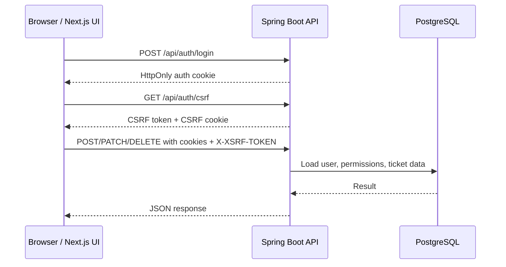
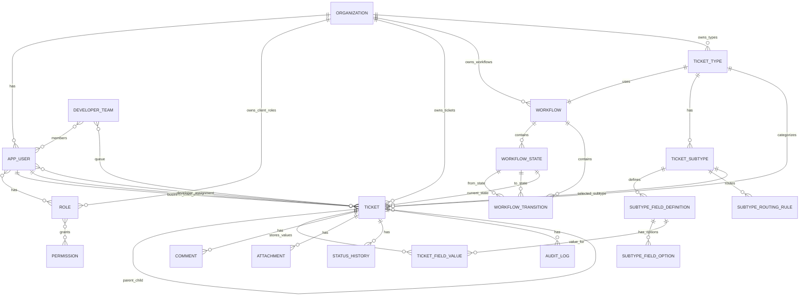
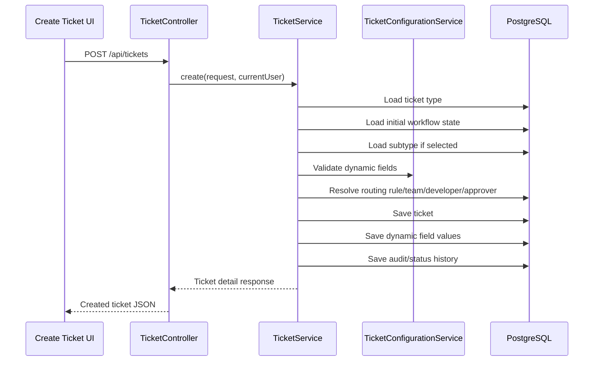
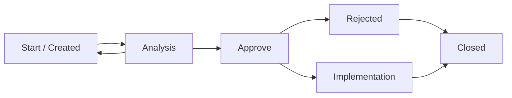
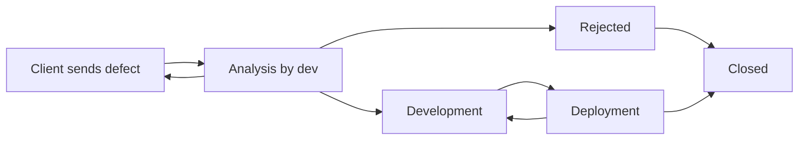
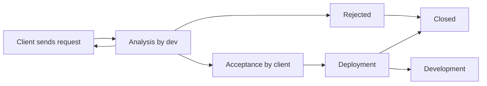

# TicketFlow1 Complete Codebase Guide

This document explains how the TicketFlow1 app is built, where the important code is, how the database is structured, and how a request moves through the system. It is written so you can use it for presenting the project and also as a map when you need to change the code later.

## 1. What the app does

TicketFlow1 is a ticket management system for two kinds of users:

- **TicketFlow1/internal users**: admins, managers, developers, team leads, and people who work on tickets.
- **Client/company users**: users from outside organizations that create or approve tickets.

The main objects are:

- **Tickets**: the work item, for example a defect, request, TASI, or USR.
- **Ticket types**: configurable categories such as `DFCT`, `REQ`, `TASI`, `USR`.
- **Subtypes**: configurable options under a type, for example firewall, network, application, hardware.
- **Dynamic fields**: extra form fields that appear depending on the selected ticket type/subtype.
- **Workflows**: states and transitions that control how tickets move.
- **Teams**: groups of users that can own tickets and order them in a Kanban-style queue.
- **Roles and permissions**: decide what users are allowed to do.
- **Organizations**: client companies using the app.

## 2. High-level architecture

The project has two main applications:

```text
ticketFlow1/
├── backend/       Spring Boot API, PostgreSQL database access, auth, business rules
├── frontend/      Next.js web UI
├── docs/          project documentation
├── specs/         feature planning/speckit files
└── docker-compose.yml
```

### Backend

The backend is a Java Spring Boot application.

Important backend technologies:

- Spring Boot web API
- Spring Security
- JPA/Hibernate
- PostgreSQL
- Flyway database migrations
- JWT authentication stored in an HttpOnly cookie
- CSRF protection for browser mutations
- Server-sent events for realtime updates

Backend entry point:

```text
backend/src/main/java/com/ticketflow1/ticketing/TicketingApplication.java
```

Backend configuration:

```text
backend/src/main/resources/application.yml
```

Database migrations:

```text
backend/src/main/resources/db/migration/
```

### Frontend

The frontend is a Next.js app.

Important frontend technologies:

- Next.js app router
- React components
- TypeScript
- Fetch API wrapper in `frontend/lib/api.ts`
- Realtime event listener in `frontend/lib/realtime.ts`

Frontend pages:

```text
frontend/app/
├── login/page.tsx
├── dashboard/page.tsx
├── tickets/page.tsx
├── tickets/new/page.tsx
├── tickets/[ticketKey]/page.tsx
├── teams/page.tsx
└── admin/
    ├── organizations/page.tsx
    ├── roles/page.tsx
    ├── users/page.tsx
    └── workflows/page.tsx
```

## 3. Request flow

Normal browser request flow:



The key point is that the browser does not store the JWT in local storage. The backend sets an HttpOnly cookie called:

```text
ticketflow1_auth
```

For actions that change data, the frontend first gets a CSRF token from:

```text
GET /api/auth/csrf
```

Then it sends that token in:

```text
X-XSRF-TOKEN
```

The frontend code for this is here:

```text
frontend/lib/api.ts
```

The backend code for this is here:

```text
backend/src/main/java/com/ticketflow1/ticketing/auth/AuthController.java
backend/src/main/java/com/ticketflow1/ticketing/auth/SecurityConfig.java
backend/src/main/java/com/ticketflow1/ticketing/auth/JwtService.java
```

## 4. Backend package map

The backend is organized by feature. Each package normally contains:

- Entity: database object
- Repository: database queries
- Service: business logic
- Controller: HTTP API
- DTOs: request/response objects

Main backend packages:

| Package | Purpose |
|---|---|
| `auth` | Login, logout, JWT cookie, current user, CSRF, security config |
| `rbac` | Roles and permissions |
| `user` | User admin and user data |
| `organization` | Client company management |
| `ticket` | Ticket creation, editing, assignment, detail responses |
| `workflow` | Ticket types, workflows, states, transitions |
| `ticketconfig` | Subtypes, dynamic fields, routing rules, decisions |
| `team` | Developer teams and Kanban ticket ordering |
| `comment` | Public and internal ticket comments |
| `attachment` | File upload/download metadata and storage |
| `realtime` | Server-sent events so users see updates without refresh |
| `audit` | Ticket audit trail |
| `configaudit` | Admin configuration audit trail |
| `dashboard` | Dashboard summary data |
| `sla` | SLA dates and status calculation |
| `statushistory` | Ticket state/status history |
| `proposal` | Change proposal flow for protected configuration/workflow changes |
| `common` | Shared errors, auditing, logging filters, pagination |

## 5. Frontend map

Main frontend files:

| File | Purpose |
|---|---|
| `frontend/app/login/page.tsx` | Login screen |
| `frontend/app/dashboard/page.tsx` | Dashboard after login |
| `frontend/app/tickets/page.tsx` | Ticket list |
| `frontend/app/tickets/new/page.tsx` | Create ticket form |
| `frontend/app/tickets/[ticketKey]/page.tsx` | Ticket detail/edit page |
| `frontend/app/teams/page.tsx` | Team/Kanban board UI |
| `frontend/app/admin/workflows/page.tsx` | Workflow canvas and ticket type admin |
| `frontend/components/WorkflowConfigurationPanels.tsx` | Subtypes, dynamic fields, routing config |
| `frontend/components/TicketExtras.tsx` | Comments and attachments on ticket detail |
| `frontend/components/TicketUi.tsx` | Shared ticket UI helpers/components |
| `frontend/components/AppShell.tsx` | App layout/navigation |
| `frontend/components/DevLogPanel.tsx` | Frontend development logs panel |
| `frontend/lib/api.ts` | Main API client |
| `frontend/lib/auth.ts` | Current user and logout helpers |
| `frontend/lib/realtime.ts` | Server-sent events listener |
| `frontend/lib/types.ts` | Shared frontend TypeScript types |

## 6. Database overview

The database is PostgreSQL. Schema changes are controlled by Flyway migration files:

```text
backend/src/main/resources/db/migration/
```

Flyway runs migrations in version order. Important migrations:

| Migration | Purpose |
|---|---|
| `V1__create_rbac.sql` | Permissions, roles, default admin role setup |
| `V2__create_workflow_model.sql` | Workflows, states, transitions, organizations |
| `V3__create_ticket.sql` | Main ticket table |
| `V5__create_comment_and_attachment.sql` | Comments and attachments |
| `V6__create_change_proposal.sql` | Proposal system |
| `V9__allow_multiple_user_roles.sql` | Multiple roles per user |
| `V13__create_developer_teams.sql` | Developer teams |
| `V14__add_team_ticket_order.sql` | Team ticket ordering |
| `V16__create_subtype_forms.sql` | Ticket subtypes and dynamic field definitions |
| `V17__create_routing_and_decisions.sql` | Routing rules and approval/decision config |
| `V18__add_ticket_workflow_context.sql` | Adds subtype, parent ticket, approver, target user context |
| `V19__add_type_availability_and_capability.sql` | Type availability/capability settings |
| `V20__seed_service_request_workflows.sql` | Seeds TASI/USR/DFCT/REQ style workflows/config |
| `V24__add_workflow_canvas_layout.sql` | Saves workflow canvas layout |
| `V25__seed_public_test_scenario.sql` | Seeds public test users, teams, tickets |

## 7. Main ER diagram

This is a simplified view of the most important tables and relationships.



## 8. Core database tables

### `organization`

Represents a client company.

Important code:

```text
backend/src/main/java/com/ticketflow1/ticketing/organization/Organization.java
backend/src/main/java/com/ticketflow1/ticketing/organization/OrganizationService.java
backend/src/main/java/com/ticketflow1/ticketing/organization/OrganizationAdminController.java
```

Important columns:

- `id`
- `name`
- `active`
- `created_at`

### `app_user`

Represents a login user.

Important code:

```text
backend/src/main/java/com/ticketflow1/ticketing/user/AppUser.java
backend/src/main/java/com/ticketflow1/ticketing/user/UserService.java
backend/src/main/java/com/ticketflow1/ticketing/user/UserAdminController.java
```

Important columns:

- `id`
- `email`
- `password_hash`
- `display_name`
- `party`
- `role_id`
- `organization_id`
- `active`

`party` is important. It tells whether the user belongs to the internal TicketFlow1 side or the client side.

```text
TICKETFLOW1
CLIENT
```

### `role`, `permission`, `role_permission`, `app_user_role`

These tables control access.

Important code:

```text
backend/src/main/java/com/ticketflow1/ticketing/rbac/Role.java
backend/src/main/java/com/ticketflow1/ticketing/rbac/Permission.java
backend/src/main/java/com/ticketflow1/ticketing/rbac/RoleAdminService.java
backend/src/main/java/com/ticketflow1/ticketing/rbac/RoleAdminController.java
```

The code checks permissions, not role names. For example, the system checks if a user has:

```text
TICKET_READ
TICKET_CREATE
TICKET_UPDATE
TICKET_ASSIGN
TICKET_TRANSITION
COMMENT_PUBLIC_WRITE
COMMENT_INTERNAL_WRITE
WORKFLOW_MANAGE
TYPE_MANAGE
ROLE_MANAGE
USER_MANAGE
```

This is why a role can be renamed but still work if it has the correct permissions.

### `ticket`

This is the central table.

Important code:

```text
backend/src/main/java/com/ticketflow1/ticketing/ticket/Ticket.java
backend/src/main/java/com/ticketflow1/ticketing/ticket/TicketService.java
backend/src/main/java/com/ticketflow1/ticketing/ticket/TicketController.java
backend/src/main/java/com/ticketflow1/ticketing/ticket/TicketRepository.java
```

Important fields:

- `ticket_key`: visible ticket/signature id, for example `TF-2000`
- `ticket_type_id`: DFCT, REQ, TASI, USR, etc.
- `subtype_id`: selected subtype, for example firewall/network/application/hardware
- `parent_ticket_id`: links a subticket to a parent ticket
- `routing_rule_id`: the matched routing rule for subtype/type
- `resolved_approver_id`: person who must approve
- `target_user_id`: used by USR modify/delete flows
- `target_user_display_snapshot`: stores the selected user name snapshot
- `current_state_id`: current workflow state
- `priority`
- `severity`
- `title`
- `description`
- `organization_id`
- `business_owner_id`
- `ticket_lead_id`
- `assigned_team`
- `current_responsibility`
- SLA timestamps such as `response_due_at`, `first_info_due_at`, `next_update_due_at`
- `closed_at`

Developer assignment is many-to-many through:

```text
ticket_developer
```

Team assignment/queue is many-to-many through:

```text
developer_team_ticket
```

### `ticket_type`

Defines ticket categories.

Important code:

```text
backend/src/main/java/com/ticketflow1/ticketing/workflow/TicketType.java
backend/src/main/java/com/ticketflow1/ticketing/workflow/WorkflowAdminService.java
backend/src/main/java/com/ticketflow1/ticketing/workflow/WorkflowAdminController.java
```

Examples:

- `DFCT`
- `REQ`
- `TASI`
- `USR`

Important fields:

- `key`
- `name`
- `workflow_id`
- `organization_id`
- `is_template`
- `requires_proposal`
- `active`
- `sort_order`
- `capability`

### `workflow`

Defines a workflow for a ticket type.

Important code:

```text
backend/src/main/java/com/ticketflow1/ticketing/workflow/Workflow.java
backend/src/main/java/com/ticketflow1/ticketing/workflow/WorkflowAdminService.java
backend/src/main/java/com/ticketflow1/ticketing/workflow/TicketTransitionService.java
```

Important fields:

- `name`
- `organization_id`
- `canvas_layout`

`canvas_layout` stores the saved visual position of nodes and lines from the interactive workflow canvas.

### `workflow_state`

Defines a step in a workflow.

Examples:

- `NEW`
- `ANALYSIS`
- `APPROVE`
- `IMPLEMENTATION`
- `DEVELOPMENT`
- `DEPLOYMENT`
- `ACCEPTANCE`
- `CLOSED`

Important fields:

- `workflow_id`
- `key`
- `is_initial`
- `is_terminal`
- `sort_order`

### `workflow_transition`

Defines allowed movement between states.

Important fields:

- `workflow_id`
- `from_state_id`
- `to_state_id`
- `required_permission_id`
- `required_party`
- `responsibility_after`
- `operation_kind`

This is what prevents users from moving a ticket to a random state.

### `ticket_subtype`

Defines configurable subtypes under a ticket type.

Example for TASI:

- firewall
- network
- application
- hardware

Important code:

```text
backend/src/main/java/com/ticketflow1/ticketing/ticketconfig/TicketSubtype.java
backend/src/main/java/com/ticketflow1/ticketing/ticketconfig/TicketConfigurationService.java
backend/src/main/java/com/ticketflow1/ticketing/ticketconfig/TicketConfigurationController.java
frontend/components/WorkflowConfigurationPanels.tsx
```

### `subtype_field_definition`

Defines dynamic fields shown when a subtype is selected.

Example:

For subtype `firewall`, you can define fields such as:

- source IP
- destination IP
- port
- protocol
- justification

Important fields:

- `subtype_id`
- `key`
- `label`
- `help_text`
- `field_kind`
- `required`
- `visibility`
- `active`
- `sort_order`
- validation bounds

Possible field kinds are defined in:

```text
backend/src/main/java/com/ticketflow1/ticketing/ticketconfig/FieldKind.java
```

### `ticket_field_value`

Stores the actual value entered for a dynamic field on a ticket.

Important code:

```text
backend/src/main/java/com/ticketflow1/ticketing/ticketconfig/TicketFieldValue.java
backend/src/main/java/com/ticketflow1/ticketing/ticketconfig/DynamicFieldValidator.java
```

This table supports multiple value types:

- text
- number
- date
- boolean
- selected option
- selected user
- selected team
- multiple selected options

### `subtype_routing_rule`

Controls automatic assignment by subtype.

This is where rules like “firewall tickets go to this developer/team/approver” belong.

Important code:

```text
backend/src/main/java/com/ticketflow1/ticketing/ticketconfig/SubtypeRoutingRule.java
backend/src/main/java/com/ticketflow1/ticketing/ticketconfig/SubtypeRoutingRuleRepository.java
backend/src/main/java/com/ticketflow1/ticketing/ticketconfig/TicketConfigurationService.java
```

### `developer_team`

Represents a team.

Important code:

```text
backend/src/main/java/com/ticketflow1/ticketing/team/DeveloperTeam.java
backend/src/main/java/com/ticketflow1/ticketing/team/DeveloperTeamService.java
backend/src/main/java/com/ticketflow1/ticketing/team/DeveloperTeamController.java
frontend/app/teams/page.tsx
```

Related tables:

- `developer_team_member`: users in a team
- `developer_team_ticket`: tickets assigned to the team, including order

The Kanban board uses the team ticket order to decide which ticket is first in line.

### `comment`

Stores ticket comments.

Important code:

```text
backend/src/main/java/com/ticketflow1/ticketing/comment/Comment.java
backend/src/main/java/com/ticketflow1/ticketing/comment/CommentService.java
backend/src/main/java/com/ticketflow1/ticketing/comment/CommentController.java
frontend/components/TicketExtras.tsx
```

Comments have visibility:

```text
PUBLIC
INTERNAL
```

Public comments are visible to client users. Internal comments are only for TicketFlow1/internal users with permission.

### `attachment`

Stores attachment metadata and points to a stored file.

Important code:

```text
backend/src/main/java/com/ticketflow1/ticketing/attachment/Attachment.java
backend/src/main/java/com/ticketflow1/ticketing/attachment/AttachmentService.java
backend/src/main/java/com/ticketflow1/ticketing/attachment/AttachmentController.java
frontend/components/TicketExtras.tsx
```

Current deployment note: Cloud Run stores attachments in `/tmp/ticketflow1-attachments`, so files are temporary. Metadata remains in PostgreSQL, but the actual file can disappear when the container restarts. For a real production app, attachment files should move to object storage.

## 9. Ticket creation flow

Main frontend page:

```text
frontend/app/tickets/new/page.tsx
```

Main backend files:

```text
backend/src/main/java/com/ticketflow1/ticketing/ticket/TicketController.java
backend/src/main/java/com/ticketflow1/ticketing/ticket/TicketService.java
backend/src/main/java/com/ticketflow1/ticketing/ticket/dto/CreateTicketRequest.java
```

Flow:



When creating a ticket, the system decides:

- Which workflow applies from `ticket_type.workflow_id`
- Which subtype is selected from `ticket_subtype`
- Which dynamic fields must be filled from `subtype_field_definition`
- Which team/developer/approver should be assigned from `subtype_routing_rule`
- Which organization owns the ticket
- Whether it is a parent ticket or a subticket

## 10. Subtickets

Subtickets use the same `ticket` table as normal tickets.

The relationship is stored by:

```text
ticket.parent_ticket_id
```

Important backend field:

```text
Ticket.parentTicket
```

Important behavior:

- Internal users can create internal subtask/subticket work.
- Client users are limited to the ticket types allowed for them, usually defect/request.
- Subtickets still have their own workflow, subtype, comments, attachments, assignments, and dynamic fields.

## 11. Workflows

A workflow is built from:

```text
workflow
workflow_state
workflow_transition
```

The ticket stores only the current state:

```text
ticket.current_state_id
```

Allowed moves are checked against `workflow_transition`.

Important code:

```text
backend/src/main/java/com/ticketflow1/ticketing/workflow/TicketTransitionService.java
backend/src/main/java/com/ticketflow1/ticketing/ticket/TicketService.java
backend/src/main/java/com/ticketflow1/ticketing/ticket/dto/TransitionTicketRequest.java
frontend/app/tickets/[ticketKey]/page.tsx
```

### TASI / USR general workflow



Important business meaning:

- TASI and USR are internal workflows.
- Type/subtype must be selected during ticket creation.
- Analysis can reject back to the start.
- Approval is done by the configured higher-up/approver.
- Implementation is done by the developer/team that analyzed or was routed to the ticket.

### DFCT workflow



### REQ workflow



## 12. Workflow admin and canvas

Frontend:

```text
frontend/app/admin/workflows/page.tsx
frontend/components/WorkflowConfigurationPanels.tsx
```

Backend:

```text
backend/src/main/java/com/ticketflow1/ticketing/workflow/WorkflowAdminController.java
backend/src/main/java/com/ticketflow1/ticketing/workflow/WorkflowAdminService.java
```

The workflow admin page manages:

- Ticket types
- Workflows
- Workflow states
- Workflow transitions
- Visual canvas layout
- Subtypes
- Dynamic fields
- Field options
- Routing rules

Canvas positions and connector paths are saved in:

```text
workflow.canvas_layout
```

That allows all users in the same company to see the same workflow layout.

## 13. Dynamic fields

Dynamic fields are used when the form changes depending on ticket type/subtype.

Example:

If the user selects:

```text
Ticket type: TASI
Subtype: Firewall
```

Then the app can show firewall-specific fields.

Configuration tables:

```text
ticket_subtype
subtype_field_definition
subtype_field_option
subtype_routing_rule
```

Value table:

```text
ticket_field_value
```

Validation code:

```text
backend/src/main/java/com/ticketflow1/ticketing/ticketconfig/DynamicFieldValidator.java
```

Admin UI:

```text
frontend/components/WorkflowConfigurationPanels.tsx
```

Ticket create/detail UI:

```text
frontend/app/tickets/new/page.tsx
frontend/app/tickets/[ticketKey]/page.tsx
```

## 14. Routing and assignment

Routing rules connect subtype/type choices to people or teams.

Example:

```text
TASI + Firewall -> Platform Operations team -> Team lead approval
USR + Delete user -> Security/Admin team -> Higher-up approval
```

Important backend code:

```text
backend/src/main/java/com/ticketflow1/ticketing/ticketconfig/SubtypeRoutingRule.java
backend/src/main/java/com/ticketflow1/ticketing/ticket/TicketService.java
```

Important ticket fields:

```text
ticket.ticket_lead_id
ticket.resolved_approver_id
ticket.routing_rule_id
ticket.assigned_team
```

Important many-to-many assignment tables:

```text
ticket_developer
developer_team_ticket
```

## 15. Teams and Kanban

Teams are managed by:

```text
backend/src/main/java/com/ticketflow1/ticketing/team/DeveloperTeamController.java
backend/src/main/java/com/ticketflow1/ticketing/team/DeveloperTeamService.java
frontend/app/teams/page.tsx
```

Team database tables:

```text
developer_team
developer_team_member
developer_team_ticket
```

The team Kanban board uses `developer_team_ticket` ordering to decide which ticket is first.

Important concepts:

- A team has a leader.
- A team has members.
- A team can have tickets.
- Ticket order can be changed.
- Team ticket assignment is visible to all users with access.

## 16. Realtime updates

Realtime events let another person see changes without refreshing the page.

Backend:

```text
backend/src/main/java/com/ticketflow1/ticketing/realtime/RealtimeController.java
backend/src/main/java/com/ticketflow1/ticketing/realtime/RealtimeEvents.java
backend/src/main/java/com/ticketflow1/ticketing/realtime/RealtimeMutationInterceptor.java
```

Frontend:

```text
frontend/lib/realtime.ts
```

The frontend connects to:

```text
GET /api/events
```

When mutations happen, the backend publishes an event. The frontend listens and reloads affected data.

This affects actions such as:

- comments
- attachments
- ticket edits
- team assignment
- workflow/ticket movement

## 17. Comments and internal comments

Comments are handled by:

```text
backend/src/main/java/com/ticketflow1/ticketing/comment/CommentController.java
backend/src/main/java/com/ticketflow1/ticketing/comment/CommentService.java
frontend/components/TicketExtras.tsx
```

Rules:

- `PUBLIC` comments are visible to client users and internal users.
- `INTERNAL` comments are only visible to internal users with internal comment permissions.

Permissions involved:

```text
COMMENT_PUBLIC_WRITE
COMMENT_INTERNAL_WRITE
COMMENT_INTERNAL_READ
```

## 18. Attachments

Frontend attachment UI:

```text
frontend/components/TicketExtras.tsx
```

Backend attachment code:

```text
backend/src/main/java/com/ticketflow1/ticketing/attachment/AttachmentController.java
backend/src/main/java/com/ticketflow1/ticketing/attachment/AttachmentService.java
backend/src/main/java/com/ticketflow1/ticketing/attachment/AttachmentUploadConfig.java
```

Configuration:

```text
backend/src/main/resources/application.yml
```

Important properties:

```yaml
app:
  attachments:
    max-size-bytes: ${ATTACHMENT_MAX_SIZE_BYTES:104857600}
    storage-directory: ${ATTACHMENT_STORAGE_DIRECTORY:./data/attachments}
```

Cloud Run currently uses:

```text
/tmp/ticketflow1-attachments
```

That is fine for testing, but not permanent production storage.

## 19. Auth and permissions

Auth files:

```text
backend/src/main/java/com/ticketflow1/ticketing/auth/AuthController.java
backend/src/main/java/com/ticketflow1/ticketing/auth/AuthService.java
backend/src/main/java/com/ticketflow1/ticketing/auth/JwtAuthFilter.java
backend/src/main/java/com/ticketflow1/ticketing/auth/JwtService.java
backend/src/main/java/com/ticketflow1/ticketing/auth/SecurityConfig.java
backend/src/main/java/com/ticketflow1/ticketing/auth/RestAccessDeniedHandler.java
backend/src/main/java/com/ticketflow1/ticketing/auth/RestAuthenticationEntryPoint.java
```

Frontend auth files:

```text
frontend/app/login/page.tsx
frontend/lib/auth.ts
frontend/lib/api.ts
```

Login process:

1. User submits email/password.
2. Backend verifies password hash.
3. Backend creates a JWT.
4. Backend writes JWT into HttpOnly cookie.
5. Frontend calls `/api/users/me` to load current user.
6. Mutating actions also use `/api/auth/csrf`.

Why HttpOnly cookie:

- JavaScript cannot read the JWT.
- This is safer than storing tokens in local storage.

Why CSRF exists:

- Because cookies are sent automatically by browsers.
- CSRF token proves the frontend intentionally made the request.

## 20. Admin areas

Admin frontend pages:

```text
frontend/app/admin/organizations/page.tsx
frontend/app/admin/roles/page.tsx
frontend/app/admin/users/page.tsx
frontend/app/admin/workflows/page.tsx
```

Admin backend controllers:

```text
backend/src/main/java/com/ticketflow1/ticketing/organization/OrganizationAdminController.java
backend/src/main/java/com/ticketflow1/ticketing/rbac/RoleAdminController.java
backend/src/main/java/com/ticketflow1/ticketing/rbac/PermissionAdminController.java
backend/src/main/java/com/ticketflow1/ticketing/user/UserAdminController.java
backend/src/main/java/com/ticketflow1/ticketing/workflow/WorkflowAdminController.java
backend/src/main/java/com/ticketflow1/ticketing/ticketconfig/TicketConfigurationController.java
```

Admin actions are protected by permissions like:

```text
USER_MANAGE
ROLE_MANAGE
WORKFLOW_MANAGE
TYPE_MANAGE
```

## 21. Development logs

Backend development logging:

```text
backend/src/main/java/com/ticketflow1/ticketing/common/DevelopmentRequestLoggingFilter.java
```

Frontend development logging:

```text
frontend/components/DevLogPanel.tsx
frontend/lib/devLogs.ts
```

Configuration:

```yaml
app:
  dev-logging:
    enabled: ${APP_DEV_LOGGING_ENABLED:true}
    slow-request-ms: ${APP_DEV_LOGGING_SLOW_REQUEST_MS:1000}
```

The logs are useful when the app says a request failed, because they show:

- API path
- HTTP status
- request id
- slow requests
- network failures
- frontend runtime errors

## 22. Deployment setup

Current public deployment:

```text
Frontend: https://frontend-one-nu-65.vercel.app
Backend:  https://ticketflow1-626333677128.europe-west12.run.app
```

Deployment docs:

```text
docs/free-internet-deployment.md
```

Backend deployment:

- Cloud Run
- Dockerfile in `backend/Dockerfile`
- PostgreSQL from Neon
- Environment variables set in Cloud Run

Frontend deployment:

- Vercel
- Important env variable:

```text
NEXT_PUBLIC_API_BASE_URL=https://ticketflow1-626333677128.europe-west12.run.app/api
```

Database:

- Neon PostgreSQL
- Connection string is stored outside Git in environment variables.

Do not commit database passwords.

## 23. Local development

Backend local run:

```bash
cd backend
JAVA_HOME=/usr/lib/jvm/java-21-openjdk-amd64 PATH=/usr/lib/jvm/java-21-openjdk-amd64/bin:$PATH JWT_SECRET=local-demo-secret-32-bytes-minimum-value ./mvnw spring-boot:run
```

Frontend local run:

```bash
cd frontend
npm run dev
```

Local frontend normally runs on:

```text
http://localhost:3000
```

Local backend default is usually:

```text
http://localhost:8081/api
```

## 24. Tests

Backend tests:

```text
backend/src/test/java/com/ticketflow1/ticketing/
```

Useful focused backend tests:

```bash
cd backend
JAVA_HOME=/usr/lib/jvm/java-21-openjdk-amd64 PATH=/usr/lib/jvm/java-21-openjdk-amd64/bin:$PATH ./mvnw -q test
```

Frontend tests:

```text
frontend/test/
```

Useful focused frontend test:

```bash
cd frontend
npm test -- --run test/api.test.ts
```

End-to-end tests:

```text
frontend/e2e/
```

## 25. Seeded public test scenario

The public test scenario is created in:

```text
backend/src/main/resources/db/migration/V25__seed_public_test_scenario.sql
```

Seeded users:

| Email | Purpose |
|---|---|
| `test.admin@ticketflow1.app` | Internal admin |
| `test.manager@ticketflow1.app` | Internal manager |
| `test.developer@ticketflow1.app` | Internal developer |
| `owner@acme-test.app` | Client owner |
| `approver@acme-test.app` | Client approver |
| `requester@acme-test.app` | Client requester |

Password for test users:

```text
TicketFlow2026!
```

Seeded organization:

```text
Acme Field Services
```

Seeded teams:

```text
Platform Operations
Client Delivery
```

Seeded tickets:

```text
TF-2000 to TF-2005
```

## 26. How to explain this project in a presentation

A good presentation order:

1. Start with the problem: companies need a controlled ticket process.
2. Explain the two user sides: internal TicketFlow1 and client organizations.
3. Show ticket creation with type/subtype/dynamic fields.
4. Show workflow movement and approvals.
5. Show teams and Kanban ordering.
6. Show admin configuration: types, subtypes, fields, routing, roles.
7. Explain security: roles, permissions, JWT cookie, CSRF.
8. Explain realtime updates.
9. Explain database migrations and why config is stored in tables.
10. End with deployment: Vercel frontend, Cloud Run backend, Neon PostgreSQL.

Short summary you can say:

> TicketFlow1 is a configurable workflow ticketing system. Instead of hard-coding every ticket form and workflow, ticket types, subtypes, dynamic fields, routing rules, roles, and workflows are stored in PostgreSQL and managed from admin screens. The backend enforces permissions and workflow transitions, while the frontend provides ticket, team, Kanban, and workflow canvas interfaces. The app is deployed with Vercel for the frontend, Cloud Run for the backend, and Neon PostgreSQL for the database.

## 27. Most important files to know

If you only remember a few files, remember these:

```text
backend/src/main/java/com/ticketflow1/ticketing/ticket/Ticket.java
backend/src/main/java/com/ticketflow1/ticketing/ticket/TicketService.java
backend/src/main/java/com/ticketflow1/ticketing/ticket/TicketController.java
backend/src/main/java/com/ticketflow1/ticketing/workflow/WorkflowAdminService.java
backend/src/main/java/com/ticketflow1/ticketing/workflow/TicketTransitionService.java
backend/src/main/java/com/ticketflow1/ticketing/ticketconfig/TicketConfigurationService.java
backend/src/main/java/com/ticketflow1/ticketing/auth/SecurityConfig.java
backend/src/main/resources/db/migration/
frontend/lib/api.ts
frontend/app/tickets/new/page.tsx
frontend/app/tickets/[ticketKey]/page.tsx
frontend/app/admin/workflows/page.tsx
frontend/app/teams/page.tsx
frontend/components/WorkflowConfigurationPanels.tsx
```

These files explain most of the system.

