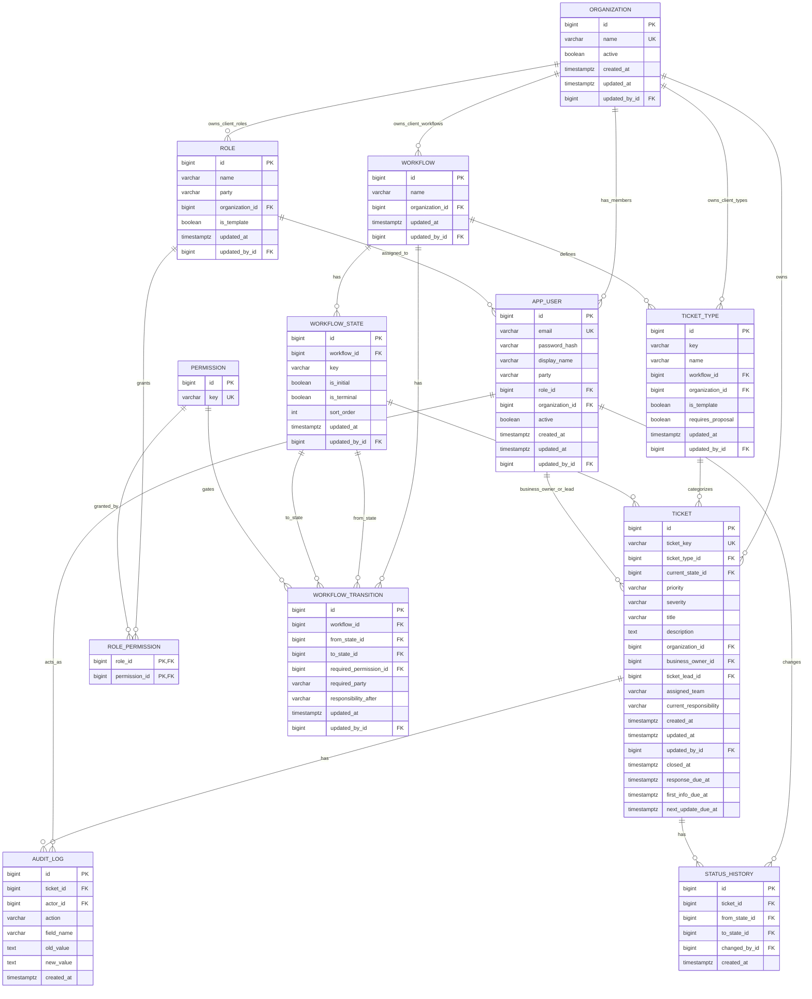

# TicketFlow1 Live Database ER

This diagram reflects the current PostgreSQL schema after Flyway migrations V1-V3 have been applied.

## Connection details

Use these values in DBeaver:

- Host: `localhost`
- Port: `5433`
- Database: `ticketflow1_ticketing`
- User: `ticketflow1`
- Password: `ticketflow1`
