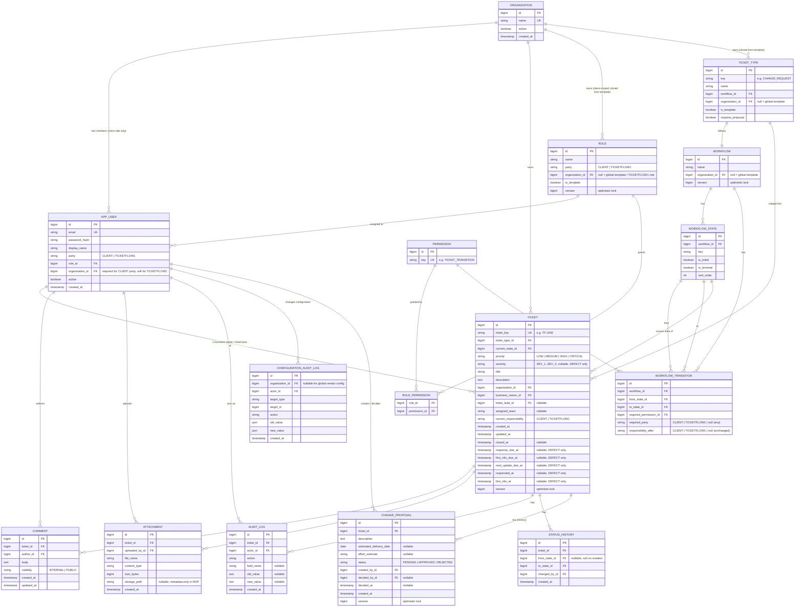

# Data Model: TicketFlow1 Ticketing Tool — MVP

**Last revised**: 2026-07-10 · production migration plan V1–V7 + demo-only V8

Derived from [spec.md](spec.md) Key Entities section and doc 02 §5. The model
has two layers: **configuration** (ticket types, workflows, roles — lookup
tables an admin edits) and **operational data** (tickets, comments, etc. that
reference the configuration). Fixed domain sets (party, severity, priority,
visibility, proposal status, responsibility) are `TEXT` columns with `CHECK`
constraints; configurable sets are lookup tables.

## Identifiers

- Primary keys are `bigint GENERATED ALWAYS AS IDENTITY` — compact, sequential,
  and simple. Access is never gated on an id being unguessable; every endpoint
  enforces permission + organization scoping server-side (FR-007, FR-020), so
  sequential ids are safe.
- Tickets additionally carry a human-readable business key `ticket_key`
  (`TF-1042`), generated from a dedicated sequence and shown throughout the UI.

## Row audit metadata

Mutable business/configuration tables store `updated_at` and `updated_by_id` so
the system can show who last changed a row and when. Append-only event tables
(`audit_log`, `configuration_audit_log`, and `status_history`) instead carry
their actor/target/timestamp fields and are never updated after insert. Fixed
reference tables and pure join tables need no misleading row-audit columns.

## Entity-Relationship Diagram



## Configuration entities

### Permission

The fixed, code-owned catalog of action keys. Reference data seeded from code;
not editable at runtime (FR-008).

| Field | Type | Rules |
|---|---|---|
| id | bigint, PK, identity | generated |
| key | varchar(60) | required, unique — e.g. `TICKET_READ`, `TICKET_CREATE`, `TICKET_UPDATE`, `TICKET_TRANSITION`, `PROPOSAL_APPROVE`, `COMMENT_PUBLIC_WRITE`, `COMMENT_INTERNAL_READ`, `COMMENT_INTERNAL_WRITE`, `USER_MANAGE`, `ROLE_MANAGE`, `TYPE_MANAGE`, `WORKFLOW_MANAGE` |

### Role

A named bundle of permissions (FR-009). Seeded from default templates; a
client-scoped role is cloned per Organization (`organization_id` set), while
`TICKETFLOW1`-party roles are global (`organization_id` null). `is_template`
marks the seed rows that new Organizations clone from.

| Field | Type | Rules |
|---|---|---|
| id | bigint, PK, identity | generated |
| name | varchar(100) | required, unique per (organization_id, name) |
| party | varchar(12) | required, `CHECK (party IN ('CLIENT','TICKETFLOW1'))` |
| organization_id | bigint, FK → organization, nullable | null = global template or TICKETFLOW1 role; set = this Organization's own role |
| is_template | boolean | default false; true for the seed rows cloned on org creation |
| version | bigint | optimistic-lock version for permission/name edits |
| updated_at | timestamptz | set on insert and update |
| updated_by_id | bigint, FK → app_user | the actor who last changed the row |

### RolePermission

Join table mapping roles to the permissions they grant.

| Field | Type | Rules |
|---|---|---|
| role_id | bigint, FK → role | PK part |
| permission_id | bigint, FK → permission | PK part |

### TicketType

A configurable ticket category bound to one workflow (FR-001). Seeded defaults:
Change Request, Task, Defect. Cloned per Organization from templates.

| Field | Type | Rules |
|---|---|---|
| id | bigint, PK, identity | generated |
| key | varchar(40) | required — e.g. `CHANGE_REQUEST` |
| name | varchar(100) | required |
| workflow_id | bigint, FK → workflow | required |
| organization_id | bigint, FK → organization, nullable | null = global template |
| version | bigint | optimistic-lock version for graph edits |
| is_template | boolean | default false |
| requires_proposal | boolean | default false; true for seeded Change Request templates/clones; custom proposal protocols are deferred |
| updated_at | timestamptz | set on insert and update |
| updated_by_id | bigint, FK → app_user | the actor who last changed the row |

### Workflow / WorkflowState / WorkflowTransition

The configured status set and legal transitions for a type (FR-002). The
transition engine loads these per ticket type and rejects any move not present.

**Workflow**

| Field | Type | Rules |
|---|---|---|
| id | bigint, PK, identity | generated |
| name | varchar(100) | required |
| organization_id | bigint, FK → organization, nullable | null = global template |
| updated_at | timestamptz | set on insert and update |
| updated_by_id | bigint, FK → app_user | the actor who last changed the row |

**WorkflowState**

| Field | Type | Rules |
|---|---|---|
| id | bigint, PK, identity | generated |
| workflow_id | bigint, FK → workflow | required |
| key | varchar(40) | required, unique per workflow — e.g. `SUBMITTED`, `ANALYSIS` |
| is_initial | boolean | exactly one per workflow |
| is_terminal | boolean | one or more per workflow (e.g. `CLOSED`, `CANCELLED`) |
| sort_order | int | for display ordering |
| updated_at | timestamptz | set on insert and update |
| updated_by_id | bigint, FK → app_user | the actor who last changed the row |

**WorkflowTransition**

| Field | Type | Rules |
|---|---|---|
| id | bigint, PK, identity | generated |
| workflow_id | bigint, FK → workflow | required |
| from_state_id | bigint, FK → workflow_state | required |
| to_state_id | bigint, FK → workflow_state | required |
| required_permission_id | bigint, FK → permission | required — the permission the actor must hold |
| required_party | varchar(12), nullable | `CHECK (... IN ('CLIENT','TICKETFLOW1'))`; restricts who may fire the transition to that party (e.g. only a client confirms a defect fix), null = any party |
| responsibility_after | varchar(12), nullable | `CHECK (... IN ('CLIENT','TICKETFLOW1'))`; sets `ticket.current_responsibility` when this transition fires, null = unchanged |
| operation_kind | varchar(24) | `STANDARD`, `PROPOSAL_CREATE`, `PROPOSAL_APPROVE`, or `PROPOSAL_REJECT`; only `STANDARD` is exposed by the generic transition endpoint |
| updated_at | timestamptz | set on insert and update |
| updated_by_id | bigint, FK → app_user | the actor who last changed the row |

## Operational entities

### Organization

A client company (always CLIENT party). Client-party users and their tickets
belong to exactly one; TICKETFLOW1-party users have none.

| Field | Type | Rules |
|---|---|---|
| id | bigint, PK, identity | generated |
| name | varchar(200) | required, unique |
| active | boolean | default true |
| created_at | timestamptz | set on insert |
| updated_at | timestamptz | set on insert and update |
| updated_by_id | bigint, FK → app_user | the actor who last changed the row |

### AppUser

`user` is a reserved word in PostgreSQL — the table is `app_user`.

| Field | Type | Rules |
|---|---|---|
| id | bigint, PK, identity | generated |
| email | varchar(255) | required, unique |
| password_hash | varchar(255) | required, BCrypt |
| display_name | varchar(200) | required |
| party | varchar(12) | required, `CHECK (party IN ('CLIENT','TICKETFLOW1'))` — structural, never set by a role |
| role_id | bigint, FK → role | required; the role's party must match the user's party |
| organization_id | bigint, FK → organization | required if party = `CLIENT`; null if party = `TICKETFLOW1` (service-layer check for a clear error) |
| active | boolean | default true |
| created_at | timestamptz | set on insert |
| updated_at | timestamptz | set on insert and update |
| updated_by_id | bigint, FK → app_user | the actor who last changed the row |

### Ticket

| Field | Type | Rules |
|---|---|---|
| id | bigint, PK, identity | generated |
| ticket_key | varchar(20) | required, unique, human-readable (`TF-1042`), from a sequence |
| ticket_type_id | bigint, FK → ticket_type | required, immutable after creation |
| current_state_id | bigint, FK → workflow_state | required; defaults to the type's workflow initial state |
| priority | varchar(10) | required, default `MEDIUM`, `CHECK (priority IN ('LOW','MEDIUM','HIGH','CRITICAL'))`, display/filter only (FR-019) |
| severity | varchar(6), nullable | `CHECK (severity IN ('SEV_1','SEV_2','SEV_3','SEV_4'))`; required when the type is Defect, null otherwise (service-layer check) |
| title | varchar(300) | required |
| description | text | required |
| organization_id | bigint, FK → organization | required and immutable; inherited for CLIENT creation, explicitly selected for TICKETFLOW1 creation (FR-021) |
| business_owner_id | bigint, FK → app_user | required; requester/creating actor in MVP and always from the ticket's org when CLIENT-party |
| ticket_lead_id | bigint, FK → app_user, nullable | TICKETFLOW1-side owner, assigned during Analysis |
| assigned_team | varchar(100), nullable | free text (e.g. "MCE", "Service Desk") |
| current_responsibility | varchar(12) | required, default `TICKETFLOW1`, `CHECK (... IN ('CLIENT','TICKETFLOW1'))` |
| created_at | timestamptz | set on insert |
| updated_at | timestamptz | set on insert and update |
| updated_by_id | bigint, FK → app_user | the actor who last changed the row |
| closed_at | timestamptz | nullable, set when the current state is terminal |
| response_due_at / first_info_due_at / next_update_due_at | timestamptz, nullable | Defect only, computed per severity formulas (doc 02 §4) when severity is set/changed |
| responded_at | timestamptz, nullable | first `REPORTED → ANALYSIS` transition; satisfies response deadline |
| first_info_at | timestamptz, nullable | first qualifying PUBLIC TicketFlow1 comment; satisfies first-info deadline |
| version | bigint | JPA optimistic-lock version; stale mutations fail with `409 CONFLICT` |

`slaStatus` is **not** a column — computed at read time (see research.md).

### ChangeProposal

| Field | Type | Rules |
|---|---|---|
| id | bigint, PK, identity | generated |
| ticket_id | bigint, FK → ticket | required; ticket's type must have `requires_proposal = true` (service-layer check) |
| description | text | required |
| estimated_delivery_date | date, nullable | |
| effort_estimate | varchar(100), nullable | free text (e.g. "5 person-days") |
| status | varchar(10) | required, default `PENDING`, `CHECK (status IN ('PENDING','APPROVED','REJECTED'))` |
| created_by_id | bigint, FK → app_user | required, TICKETFLOW1-side |
| decided_by_id | bigint, FK → app_user, nullable | must hold `PROPOSAL_APPROVE` and be CLIENT party in the ticket's org (FR-011) |
| decided_at | timestamptz, nullable | set on approve/reject |
| created_at | timestamptz | set on insert |
| updated_at | timestamptz | set on insert and update |
| updated_by_id | bigint, FK → app_user | the actor who last changed the row |
| version | bigint | optimistic-lock version for concurrent decisions |

A ticket may have multiple proposals over time (rejection → resubmission);
"current proposal" = most recent by `created_at`.

### Comment

| Field | Type | Rules |
|---|---|---|
| id | bigint, PK, identity | generated |
| ticket_id | bigint, FK → ticket | required |
| author_id | bigint, FK → app_user | required |
| body | text | required, non-empty |
| visibility | varchar(10) | required, `CHECK (visibility IN ('INTERNAL','PUBLIC'))` |
| created_at / updated_at | timestamptz | |
| updated_by_id | bigint, FK → app_user | the actor who last changed the row |

### Attachment

| Field | Type | Rules |
|---|---|---|
| id | bigint, PK, identity | generated |
| ticket_id | bigint, FK → ticket | required |
| uploaded_by_id | bigint, FK → app_user | required |
| file_name | varchar(255) | required |
| content_type | varchar(100) | required |
| size_bytes | bigint | required |
| storage_path | varchar(500), nullable | null for MVP (metadata-only per spec Assumptions) |
| created_at | timestamptz | |
| updated_at | timestamptz | set on insert and update |
| updated_by_id | bigint, FK → app_user | the actor who last changed the row |

### AuditLog

Append-only; no update/delete operations exposed.

| Field | Type | Rules |
|---|---|---|
| id | bigint, PK, identity | generated |
| ticket_id | bigint, FK → ticket | required |
| actor_id | bigint, FK → app_user | required |
| action | varchar(40) | required, `CHECK` over ticket actions (`TICKET_CREATED`, `STATUS_CHANGED`, `ASSIGNEE_CHANGED`, `COMMENT_ADDED`, `PROPOSAL_CREATED`, `PROPOSAL_APPROVED`, `PROPOSAL_REJECTED`, `SEVERITY_CHANGED`, `PRIORITY_CHANGED`, `ATTACHMENT_ADDED`, `TICKET_UPDATED`) |
| field_name | varchar(100), nullable | set for field-change actions |
| old_value / new_value | text, nullable | |
| created_at | timestamptz | |

### StatusHistory

Append-only; separate from AuditLog so the ticket detail page renders a clean
lifecycle timeline without filtering the general audit feed.

| Field | Type | Rules |
|---|---|---|
| id | bigint, PK, identity | generated |
| ticket_id | bigint, FK → ticket | required |
| from_state_id | bigint, FK → workflow_state, nullable | null for the initial creation entry |
| to_state_id | bigint, FK → workflow_state | required |
| changed_by_id | bigint, FK → app_user | required |
| created_at | timestamptz | |

### ConfigurationAuditLog

Append-only audit for mutations that do not belong to a ticket. CLIENT-scoped
records carry their Organization; global TicketFlow1 configuration uses a null
`organization_id`. Old/new values are bounded JSON summaries, never secrets.

| Field | Type | Rules |
|---|---|---|
| id | bigint, PK, identity | generated |
| organization_id | bigint, FK → organization, nullable | tenant scope; null for global vendor configuration |
| actor_id | bigint, FK → app_user | required |
| target_type | varchar(40) | `ORGANIZATION`, `ROLE`, `TICKET_TYPE`, `WORKFLOW` |
| target_id | bigint | required |
| action | varchar(40) | required |
| old_value / new_value | jsonb, nullable | bounded, secret-free change summaries |
| created_at | timestamptz | required, immutable |

## Fixed vs configurable value sets

- **Fixed sets** — party, severity, priority, comment visibility, proposal
  status, responsibility, and the audit action catalog — are `TEXT` columns
  with `CHECK` constraints. Their values follow business rules and change only
  by migration; a `CHECK` gives the same integrity guarantee as a native type
  while evolving with a single `ALTER TABLE ... DROP/ADD CONSTRAINT`.
- **Audit metadata** — mutable domain/configuration tables carry `updated_at`
  and `updated_by_id`; append-only event and fixed-reference tables use their
  purpose-specific actor/timestamp fields.
- **Configurable sets** — ticket type, workflow state, and role — are lookup
  tables so an admin can add or adjust them at runtime (FR-001, FR-009).
- **Severity stays fixed** specifically because the SLA formulas are keyed to
  `SEV_1`–`SEV_4`; making it configurable would break SLA calculation.

## Flyway migration plan

One migration per logical unit, in build order, so each phase has its own
reviewable migration:

```text
V1__create_rbac.sql            -- permission (+ seed catalog), role, role_permission, organization, app_user; seed default role templates + mappings
V2__create_workflow_model.sql  -- ticket_type, workflow, workflow_state, workflow_transition; include audit columns on every table; seed the 3 default types and their workflows
V3__create_ticket.sql          -- ticket (+ TF- sequence), append-only status_history and ticket audit_log
V4__phase3_hardening.sql       -- optimistic-lock columns, transition operation_kind, configuration_audit_log
V5__create_comment_and_attachment.sql -- comment and attachment tables with audit columns
V6__create_change_proposal.sql  -- change_proposal table with audit/version columns and one-pending constraint
V7__add_defect_sla_events.sql  -- responded_at/first_info_at and SLA query indexes
demo/V8__seed_demo_data.sql    -- demo-only Flyway location/profile; never production
```

## Validation rules summary (service-layer, not just DB constraints)

- A transition is applied only if it exists in the ticket type's workflow and
  the actor holds the transition's `required_permission` (FR-002, FR-007).
- The public transition endpoint accepts only `operation_kind = STANDARD`;
  proposal operation kinds are invoked by `ChangeProposalService` only.
- Only a ticket whose type has `requires_proposal = true` may have a
  `ChangeProposal`; such a type cannot pass its proposal state without an
  `APPROVED` proposal (FR-003).
- Approving/rejecting a proposal requires `PROPOSAL_APPROVE` **and** CLIENT
  party in the ticket's own organization (FR-011).
- Authorization checks test permissions, never role names (FR-007); a role's
  `party` must match its assigned users' `party`, and no role grants
  cross-party visibility (FR-010).
- `severity` required and only settable on Defect-type tickets; SLA fields
  recompute whenever `severity` changes, old values captured in the audit log.
- Optimistic version checks reject stale ticket/proposal/configuration updates
  with `409 CONFLICT`.
- `INTERNAL` comments are returned only to users holding
  `COMMENT_INTERNAL_READ`; client-side default roles do not
  (FR-012), enforced in the service layer's response mapping.
- Every ticket query for a CLIENT-party caller is filtered by
  `organization_id = caller.organization_id`; TICKETFLOW1-party callers are
  unfiltered (FR-020).
- Client-scoped configuration (roles, types, workflows) is cloned per
  Organization from the seeded templates on Organization creation (FR-022).
