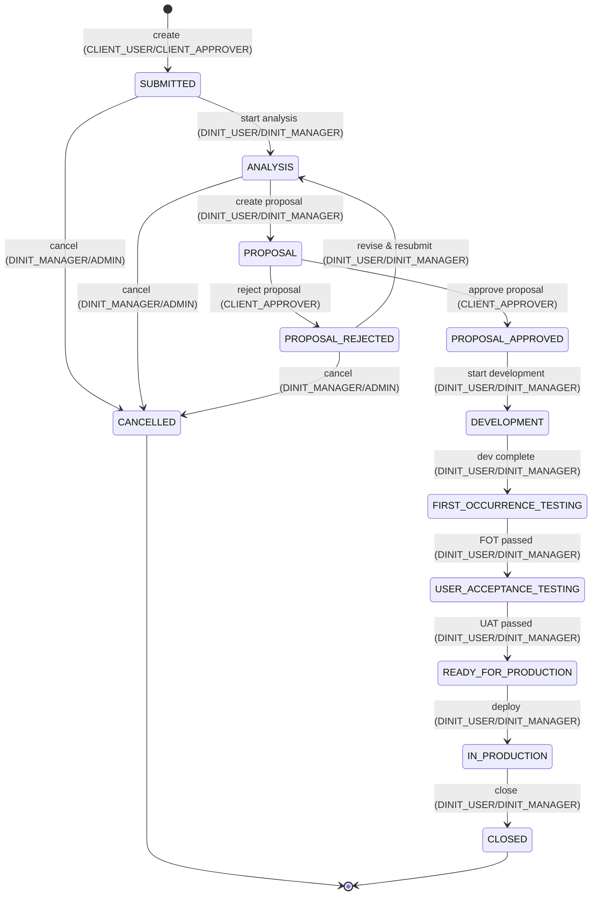

# US1 — Change Request lifecycle with proposal approval

**Priority**: P1 · **Source**: [spec.md § User Story 1](../spec.md#user-scenarios--testing-mandatory)

## Story

A client contributor submits a request for a service enhancement. A Dinit
ticket lead analyzes it and writes a proposal (scope, estimated delivery). A
client approver reviews the proposal and approves or rejects it. Once
approved, Dinit develops, tests, and releases the change, and the ticket is
closed.

**Why P1**: This is the feature that makes the tool "process-based" rather
than generic CRUD. The proposal approval gate and the distinction between
Change Requests and Tasks is the single most business-specific requirement
in doc 02.

## Lifecycle

`currentResponsibility` flips to `CLIENT` on entering `PROPOSAL` and back to
`DINIT` on entering `PROPOSAL_APPROVED` or `PROPOSAL_REJECTED`; `DINIT` for
every other state. Full diagram + all three lifecycles: [plan.md § Workflow State Machines](../plan.md#workflow-state-machines).

## Acceptance scenarios

1. **Given** a client contributor is logged in, **when** they submit a new
   Change Request, **then** the ticket is created with status `SUBMITTED`,
   type `CHANGE_REQUEST`, and `currentResponsibility = DINIT`.
2. **Given** a Change Request in `SUBMITTED`, **when** a Dinit ticket lead
   moves it to `ANALYSIS` then creates a proposal, **then** the ticket status
   becomes `PROPOSAL` and `currentResponsibility` switches to `CLIENT`.
3. **Given** a proposal in `PENDING`, **when** the client approver approves
   it, **then** the proposal status becomes `APPROVED`, the ticket status
   becomes `PROPOSAL_APPROVED` (then `DEVELOPMENT` once Dinit picks it up),
   and `currentResponsibility` switches back to `DINIT`.
4. **Given** a proposal in `PENDING`, **when** the client approver rejects
   it, **then** the proposal status becomes `REJECTED`, the ticket status
   becomes `PROPOSAL_REJECTED`, and the ticket lead can move it back to
   `ANALYSIS` or to `CANCELLED`.
5. **Given** a Change Request not yet at `PROPOSAL_APPROVED`, **when** any
   user attempts to transition it directly to `DEVELOPMENT`, **then** the
   system rejects the transition as invalid for the current state.
6. **Given** a client contributor, **when** they attempt to approve their
   own proposal, **then** the system rejects the action — only
   `CLIENT_APPROVER` role may approve/reject.

**Edge case** (see [spec.md § Edge Cases](../spec.md#edge-cases)): no limit
on rejection/resubmission cycles in MVP — the ticket lead can always attempt
another proposal or cancel.

## Requirements

FR-001, FR-002, FR-003, FR-006, FR-010, FR-011, FR-018 — full text in
[spec.md § Functional Requirements](../spec.md#functional-requirements).

## API

| Endpoint | Contract |
|---|---|
| `POST /api/tickets` (type=CHANGE_REQUEST) | [contracts/tickets.md](../contracts/tickets.md) |
| `POST /api/tickets/{ticketKey}/transition` | [contracts/tickets.md](../contracts/tickets.md) |
| `POST /api/tickets/{ticketKey}/proposals` | [contracts/proposals.md](../contracts/proposals.md) |
| `POST /api/proposals/{proposalId}/approve` | [contracts/proposals.md](../contracts/proposals.md) |
| `POST /api/proposals/{proposalId}/reject` | [contracts/proposals.md](../contracts/proposals.md) |

## Entities

`Ticket`, `ChangeProposal` — field definitions in [data-model.md](../data-model.md).

## Tasks

- Phase 2 (Ticket Core): T021, T022
- Phase 3 (Workflow/Transitions): T026, T027, T028, T029
- Phase 5 (Change Proposals — dedicated to this story): T043–T049
- Phase 7 (Frontend): T062, T063

Full task text: [tasks.md](../tasks.md). Verify gates for this feature: T025
(ticket core), T034 (transitions), **T049** (full CR flow end-to-end,
including one rejection-and-resubmission cycle — the definitive check for
this story).

## Success criteria

SC-001 (full lifecycle incl. rejection/resubmission with no manual data
correction), SC-002 (100% of actions audited) — [spec.md § Success Criteria](../spec.md#success-criteria).
