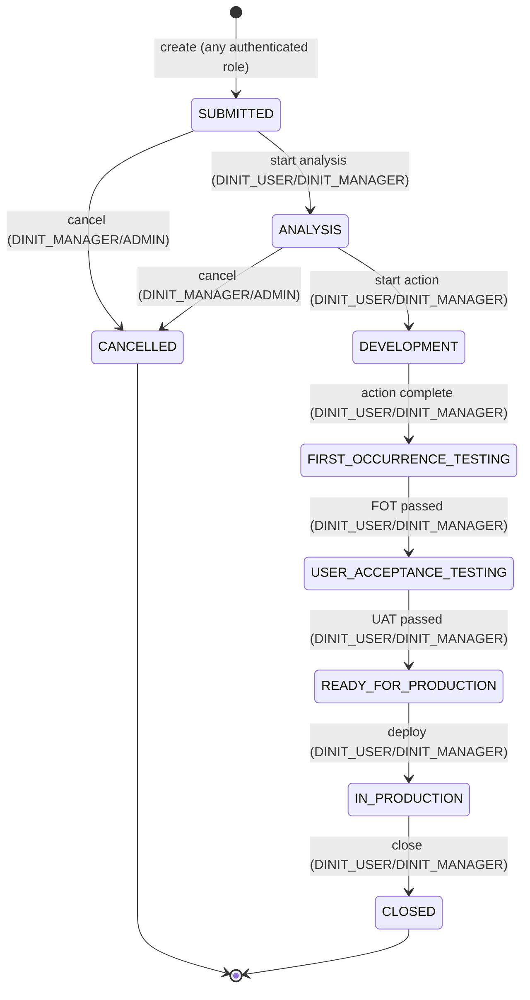

# US2 — Task lifecycle without proposal approval

**Priority**: P2 · **Source**: [spec.md § User Story 2](../spec.md#user-scenarios--testing-mandatory)

## Story

A client or Dinit user submits a Task — an operational request that needs
action but no source-code change. It skips the proposal step entirely and
moves straight from analysis to execution to closure.

**Why P2**: Demonstrates that ticket types are not forced into one generic
flow — a Task is simpler by design, not by omission (doc 02 §2).

## Lifecycle

No `PROPOSAL`/`PROPOSAL_APPROVED`/`PROPOSAL_REJECTED` states are ever legal
for `TASK` — the transition map for `TASK` simply omits them, so any attempt
lands on `409 ILLEGAL_TRANSITION`. `currentResponsibility` stays `DINIT`
throughout (no client approval step to hand responsibility back). Compare
directly with [US1's diagram](US1-change-request.md#lifecycle) — same
states minus the proposal detour.

## Acceptance scenarios

1. **Given** a Task in `SUBMITTED`, **when** a Dinit user moves it to
   `ANALYSIS`, **then** the next valid transition is directly to
   `DEVELOPMENT` — `PROPOSAL` is not a legal state for this ticket type.
2. **Given** a Task, **when** any user attempts to create a Change Proposal
   against it, **then** the system rejects the action — proposals only
   apply to `CHANGE_REQUEST` tickets.

## Requirements

FR-001, FR-002, FR-003 (the negative case — Tasks MUST NOT have a proposal
step) — full text in [spec.md § Functional Requirements](../spec.md#functional-requirements).

## API

| Endpoint | Contract |
|---|---|
| `POST /api/tickets` (type=TASK) | [contracts/tickets.md](../contracts/tickets.md) |
| `POST /api/tickets/{ticketKey}/transition` | [contracts/tickets.md](../contracts/tickets.md) |

No proposal endpoints apply to this type — `POST /api/tickets/{ticketKey}/proposals`
returns `409 INVALID_STATE` for a `TASK` ticket (see [contracts/proposals.md](../contracts/proposals.md)).

## Entities

`Ticket` only — no `ChangeProposal` row is ever created for this type.

## Tasks

Task lifecycle logic is built alongside US1/US3 as shared infrastructure
(one `TicketStatus` enum, per-type transition maps), not as a separate
implementation track:

- Phase 2 (Ticket Core): T021, T022
- Phase 3 (Workflow/Transitions): T026, T027, T028, T029
- Phase 7 (Frontend): T062, T063

Full task text: [tasks.md](../tasks.md). Verify gate: T034 (transitions
phase) covers the illegal-transition rejection this story depends on.

## Success criteria

SC-007: a Task can be taken from submission to closed without a proposal
ever being created or required, in fewer status transitions than the
equivalent Change Request flow — [spec.md § Success Criteria](../spec.md#success-criteria).
