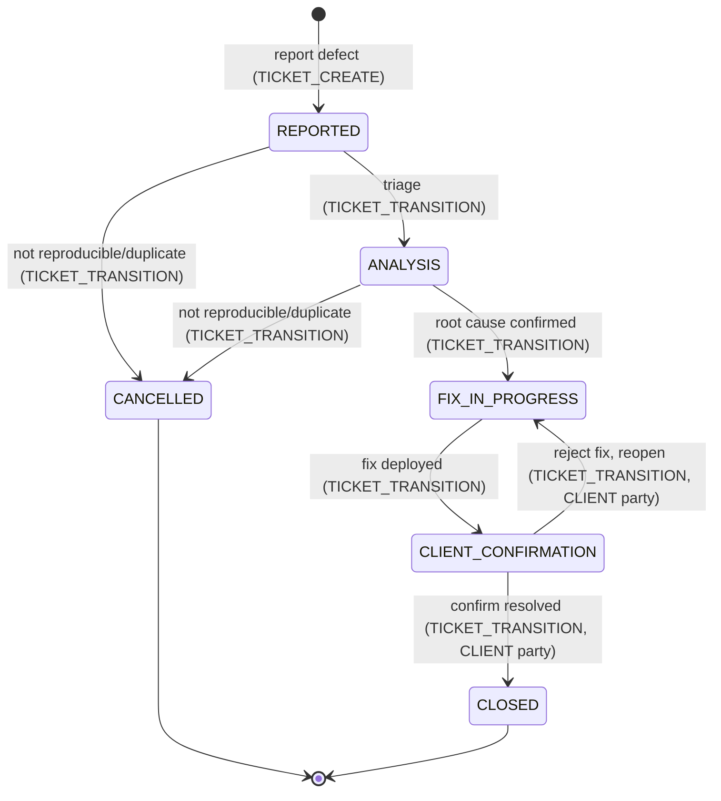

# US3 — Defect reporting with severity and SLA tracking

**Priority**: P1 · **Source**: [spec.md § User Story 3](../spec.md#user-scenarios--testing-mandatory)

## Story

A client user reports a defect with an initial severity (`SEV_1`–`SEV_4`). The
ticket lead validates or revises it during triage. The system calculates response, first-info, and
next-update deadlines from that severity and continuously reflects whether
the ticket is `OK`, `DUE_SOON`, or `BREACHED`. Once fixed, the client
confirms resolution before the ticket closes.

**Why P1**: SLA tracking on defects is doc 02's other standout
business-specific feature (§4) and directly reflects the mentor's Incident
Management SLA table — equal priority to the Change Request flow (US1). It
runs on the seeded default **Defect** type and its default workflow.

## Lifecycle (seeded default Defect workflow)

Every transition requires the `TICKET_TRANSITION` permission; the two client
confirmation moves are additionally restricted to CLIENT party. Severity is a
**fixed** set (`SEV_1`–`SEV_4`) — it is required at creation, may be revised
during `ANALYSIS`, and does not gate any transition directly.
`currentResponsibility` is `TICKETFLOW1` through `FIX_IN_PROGRESS`, flips to
`CLIENT` on entering `CLIENT_CONFIRMATION`.

## SLA formulas (doc 02 §4, simplified for MVP)

| Severity | responseDueAt | firstInfoDueAt | nextUpdateDueAt |
|---|---|---|---|
| SEV_1 | createdAt + 15m | createdAt + 45m | lastUpdateAt + 120m |
| SEV_2 | createdAt + 30m | createdAt + 60m | lastUpdateAt + 240m |
| SEV_3 | createdAt + 60m (business hours) | createdAt + 90m (business hours) | — |
| SEV_4 | next business day | — | — |

`slaStatus` (`OK`/`DUE_SOON`/`BREACHED`/`NOT_APPLICABLE`) is **computed at
read time**, not persisted or job-driven — see [research.md § SLA calculation](../research.md#sla-calculation-event-aware-and-computed-at-read-time)
for why. Full field definitions: [data-model.md § Ticket](../data-model.md#ticket).
The response obligation completes when the ticket first enters `ANALYSIS`
(`respondedAt`); the first-info obligation completes on the first public
TicketFlow1 comment (`firstInfoAt`). Each later public TicketFlow1 update
advances `nextUpdateDueAt`. Completed obligations no longer contribute to the
current status. `DUE_SOON` means the active deadline is within the final 25%
of its window, with a minimum five-minute warning window.

## Acceptance scenarios

1. **Given** a new Defect ticket, **when** it is created with severity
   `SEV_1`, **then** `responseDueAt = createdAt + 15m`,
   `firstInfoDueAt = createdAt + 45m`, and `slaStatus = OK`.
2. **Given** a `SEV_1` defect whose `responseDueAt` has passed while
   `respondedAt` is absent, **when** the ticket or dashboard is viewed,
   **then** `slaStatus` shows `BREACHED`.
3. **Given** a defect approaching (but not past) its next update deadline,
   **when** the ticket or dashboard is viewed, **then** `slaStatus` shows
   `DUE_SOON`.
4. **Given** a defect ticket lead marks the fix deployed, **when** the
   client confirms resolution, **then** the ticket moves to `CLOSED`; if the
   client does not confirm, the ticket stays in `CLIENT_CONFIRMATION`.
5. **Given** a `TASK` or `CHANGE_REQUEST` ticket, **when** its SLA fields
   are inspected, **then** they are absent/`NOT_APPLICABLE` — SLA tracking
   applies only to `DEFECT` tickets. Severity is a fixed set because the SLA
   formulas are keyed to it.

**Edge case** (see [spec.md § Edge Cases](../spec.md#edge-cases)): a
`SEV_1` defect downgraded to `SEV_3` recomputes SLA deadlines from the
*original* `createdAt` using the new severity's formula, and logs the
severity change in the audit trail — it does not freeze the original
deadlines.

## Requirements

FR-001, FR-004, FR-005, FR-006, FR-007 — full text in
[spec.md § Functional Requirements](../spec.md#functional-requirements).

## API

| Endpoint | Contract |
|---|---|
| `POST /api/tickets` (type=DEFECT, severity required) | [contracts/tickets.md](../contracts/tickets.md) |
| `GET /api/tickets/{ticketKey}` (`sla` block in response) | [contracts/tickets.md](../contracts/tickets.md) |
| `PATCH /api/tickets/{ticketKey}` (severity change) | [contracts/tickets.md](../contracts/tickets.md) |
| `POST /api/tickets/{ticketKey}/transition` | [contracts/tickets.md](../contracts/tickets.md) |
| `GET /api/tickets?slaStatus=BREACHED` | [contracts/tickets.md](../contracts/tickets.md) |
| `GET /api/dashboard` (`slaBreached`/`slaDueSoon` cards) | [contracts/dashboard.md](../contracts/dashboard.md) |

## Entities

`Ticket` (SLA deadline fields + severity), `AuditLog` (severity-change
history).

## Tasks

- Phase 2 (Ticket Core): T023, T024, T025 (`slaStatus` filter stubbed here,
  wired in Phase 6)
- Phase 3 (Workflow/Transitions): T028, T029, T030
- Phase 6 (Defect SLA): T061–T068, T071
- Phase 7 (Frontend): T080, T083–T085

Full task text: [tasks.md](../tasks.md). Verify gate: **T071** — create a
`SEV_1` defect, confirm due-dates are immediate; via a backdated-`createdAt`
integration test, confirm `slaStatus` flips to `BREACHED` with no manual
recalculation call.

## Success criteria

SC-003 (deadlines visible on the same page load as ticket creation, no
separate calculation step), SC-004 (SLA-breached/due-soon identifiable from
one dashboard view) — [spec.md § Success Criteria](../spec.md#success-criteria).
