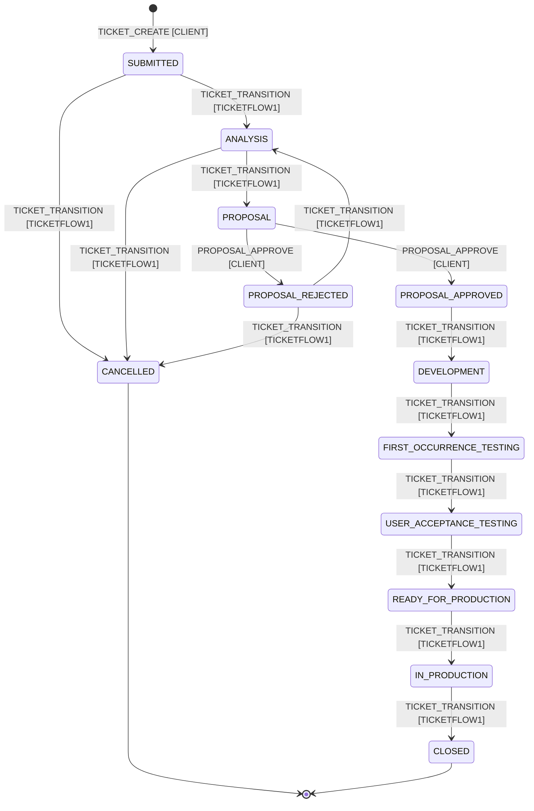
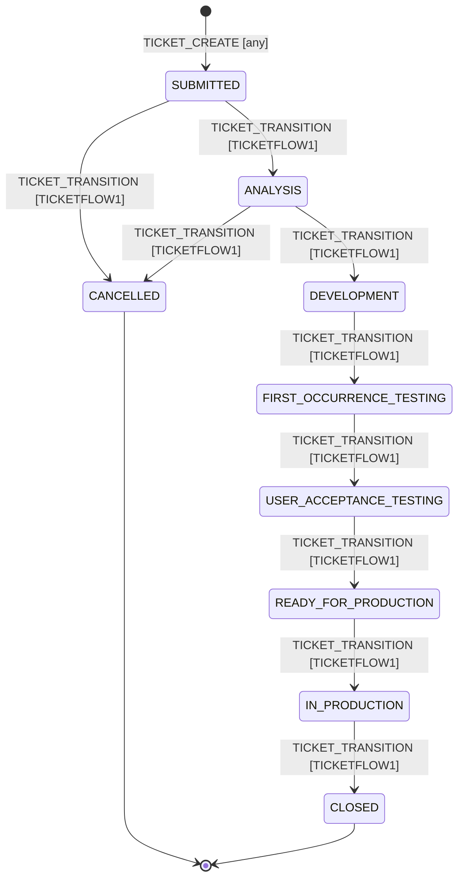
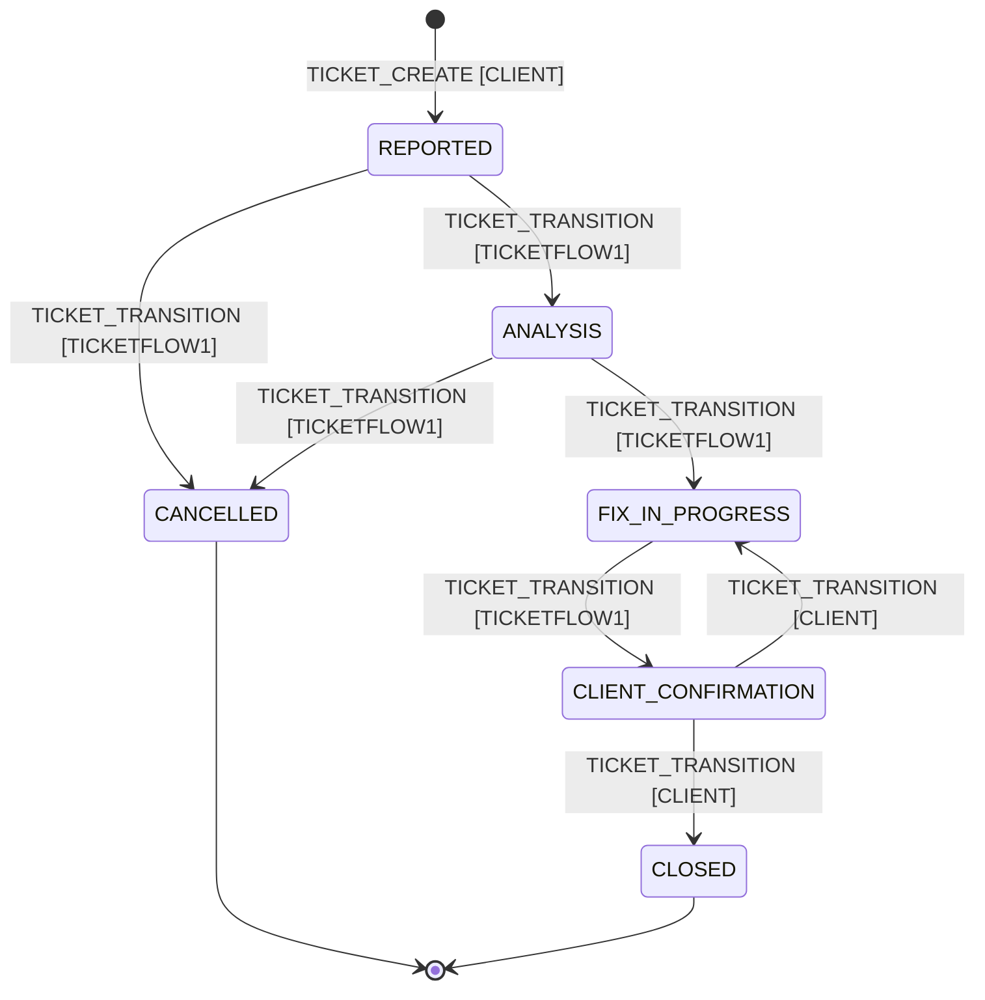

# Implementation Plan: TicketFlow1 Ticketing Tool — MVP

**Branch**: `001-ticketing-mvp` | **Date**: 2026-07-02 | **Spec**: [spec.md](spec.md)

**Input**: Feature specification from `specs/001-ticketing-mvp/spec.md`

## Summary

Build a process-based internal ticketing tool where ticket **types**, their
**workflows**, and **roles** are configuration (seeded with defaults Change
Request / Task / Defect and the five default roles), access is enforced by
**permission** server-side, Change Requests carry a client proposal approval
gate, Defects have severity-driven SLA deadline tracking, and client
Organizations are isolated while TICKETFLOW1-party users work across all of
them. Comments, attachments, audit log, status history, and a dashboard round
it out. Backend is Java 21/Spring Boot/PostgreSQL, frontend is
Next.js/TypeScript/Tailwind, per the constitution's fixed stack.

## Technical Context

**Language/Version**: Java 21 (backend), TypeScript / Node 20+ (frontend)

**Primary Dependencies**: Spring Boot 3.x, Spring Web, Spring Data JPA,
Spring Security (method-level `@PreAuthorize` on permission authorities),
Flyway, springdoc-openapi (Swagger UI), jjwt (JWT signing/parsing); Next.js
(App Router), Tailwind CSS

**Storage**: PostgreSQL 16 (via Docker Compose for local dev). `bigint`
identity primary keys; fixed value sets as `TEXT` + `CHECK`; configurable sets
(ticket type, workflow state, role) as lookup tables (data-model.md)

**Testing**: JUnit 5 + Spring Boot Test, Testcontainers (PostgreSQL) for
integration tests; manual verification for frontend (see research.md)

**Target Platform**: Linux container (Docker Compose locally; deployment
target not decided — out of scope for MVP)

**Project Type**: Web application (backend + frontend, monorepo)

**Performance Goals**: No formal target — internal tool, single-digit
concurrent demo users. Not a constraint that shapes design decisions here.

**Constraints**: None beyond the constitution's fixed stack and the 30-day
timeline; SLA calculation must be correct, not necessarily sub-millisecond.

**Scale/Scope**: Tens of users, low hundreds of tickets for demo/pilot use —
not designed for production multi-thousand-user scale.

## Constitution Check

*Gate: must pass before Phase 0 research. Re-checked after Phase 1 design.*

| Principle | Check | Status |
|---|---|---|
| I. Typed lifecycles, validated transitions | `TicketTransitionService` loads each type's workflow (states + transitions) from the DB and rejects any move not defined for the ticket's current state; no generic PATCH-to-any-status path. Seeded and custom workflows validate identically | PASS |
| II. Audit everything | Every mutating endpoint contract (tickets, comments, proposals, attachments, config) specifies its audit log entry (contracts/), including `CONFIG_CHANGED` for role/type/workflow edits | PASS |
| III. Permission-based access is core value | Authorization checks permission authorities (`@PreAuthorize` + service-layer party/org/transition checks), never role names; the party axis and proposal gate stay fixed | PASS |
| IV. Backend before UI polish | Task breakdown follows constitution build order: RBAC/config foundation → ticket core → workflow engine → comments → proposals → SLA → frontend → polish | PASS |
| V. Small verified steps | App runs on seeded defaults at every step; testing strategy (research.md) enables per-slice verification; no big-bang generation | PASS |
| VI. Bounded configurability, no overengineering | Types/workflows/roles are data within a fixed schema; permission catalog, party axis, and severity stay fixed. Rejected Spring Statemachine, scheduled SLA jobs, TanStack Query, per-tenant code — justified in research.md | PASS |
| VII. Teach, don't just deliver | Out of scope for this document — enforced during implementation per constitution | N/A |

No violations requiring Complexity Tracking justification.

## Project Structure

### Documentation (this feature)

```text
specs/001-ticketing-mvp/
├── spec.md                # Feature specification
├── plan.md                # This file
├── research.md            # Phase 0 output
├── data-model.md          # Phase 1 output — ERD, entities, Flyway plan
├── quickstart.md          # Phase 1 output — how to run and validate
├── contracts/             # Phase 1 output — API contracts
│   ├── README.md
│   ├── auth.md
│   ├── tickets.md
│   ├── comments.md
│   ├── attachments.md
│   ├── proposals.md
│   ├── audit-and-history.md
│   ├── dashboard.md
│   └── admin.md           # users, organizations, roles/permissions, types/workflows
├── checklists/
│   └── requirements.md
└── tasks.md               # Phase 2 output (/speckit-tasks)
```

### Source Code (repository root)

```text
backend/
├── src/main/java/com/ticketflow1/ticketing/
│   ├── auth/                 # JWT filter, login controller, security config
│   ├── rbac/                 # Permission catalog, Role, RolePermission entities;
│   │                         #   PermissionEvaluator wiring for @PreAuthorize
│   ├── organization/         # Organization entity, repository, admin endpoints
│   ├── user/                 # AppUser entity (party + role_id), repo, admin endpoints
│   ├── workflow/             # TicketType, Workflow, WorkflowState, WorkflowTransition
│   │   └── TicketTransitionService.java  # loads a type's workflow from DB, validates moves
│   ├── ticket/
│   │   ├── Ticket.java, TicketService.java, TicketRepository.java, TicketController.java
│   │   └── dto/              # request/response DTOs (contracts/tickets.md)
│   ├── proposal/             # ChangeProposal entity/service/controller
│   ├── comment/
│   ├── attachment/
│   ├── audit/                # AuditLog entity + AuditService (used by other services)
│   ├── statushistory/
│   ├── sla/                  # SLA calculation service (research.md)
│   ├── dashboard/
│   └── common/               # error handling (@ControllerAdvice), pagination envelope
├── src/main/resources/
│   ├── db/migration/         # Flyway V1__..V6__ (data-model.md)
│   └── application.yml
└── src/test/java/...         # unit tests (transition engine, SLA calc) + Testcontainers integration tests

frontend/
├── app/
│   ├── login/
│   ├── dashboard/
│   ├── tickets/
│   │   ├── page.tsx           # list + filters
│   │   ├── new/page.tsx
│   │   └── [ticketKey]/page.tsx # detail: comments, attachments, proposal, history, transition buttons
│   └── admin/
│       ├── users/page.tsx
│       └── config/page.tsx    # roles, types, workflows
├── lib/
│   ├── api.ts                 # typed fetch client (research.md)
│   └── auth.ts                # auth cookie-aware helpers + current-user fetch
└── components/                # shared UI (StatusBadge, SlaBadge, TransitionButtons, etc.)
```

**Structure Decision**: Web application, monorepo with `backend/` +
`frontend/` at repo root (per constitution Technology Stack). Backend organized
by domain package (`rbac/`, `workflow/`, `ticket/`, `proposal/`, ...) rather
than by technical layer globally — each domain package internally follows
controller → service → repository → dto, but grouping by domain keeps a
lifecycle change from touching five unrelated top-level folders. Configuration
(`rbac/`, `workflow/`) is its own set of packages because the transition engine
and permission evaluator are consumed across the whole app.

## Workflow engine

`TicketTransitionService` is **config-driven**: given a ticket, it loads that
ticket's type → workflow → the set of `WorkflowTransition` rows out of its
current state, and accepts a move only if a matching transition exists **and**
the actor holds the transition's `required_permission` (and matches
`required_party`, when set). It then applies `responsibility_after`, writes a
`StatusHistory` row and a `STATUS_CHANGED` audit entry. The same code path
serves seeded and custom workflows — the validation guarantee is identical
(constitution Principle I).

The diagrams below document the three **seeded default** workflows (stored as
`workflow`/`workflow_state`/`workflow_transition` rows, cloned per Organization).
Each transition is annotated `PERMISSION [party]` — the `required_permission`
and, where the step is party-specific, the `required_party`.

### Change Request lifecycle (seeded default)



`responsibility_after = CLIENT` on the transition into `PROPOSAL`, and
`TICKETFLOW1` on the transitions into `PROPOSAL_APPROVED`/`PROPOSAL_REJECTED`;
otherwise unchanged (`TICKETFLOW1`).

### Task lifecycle (seeded default)



The Task workflow has no `PROPOSAL*` states and its type has
`requires_proposal = false`, so a proposal can never be created against it and
any transition into a proposal state simply does not exist → `409
ILLEGAL_TRANSITION` (spec User Story 2). `currentResponsibility` stays
`TICKETFLOW1` throughout.

### Defect lifecycle (seeded default)



Severity (`SEV_1`–`SEV_4`) is set at creation or during `ANALYSIS` and drives
the SLA deadline fields (data-model.md); it does not gate any transition
directly. `responsibility_after = CLIENT` on the transition into
`CLIENT_CONFIRMATION`; `TICKETFLOW1` through `FIX_IN_PROGRESS`.

## Complexity Tracking

*No entries — Constitution Check passed with no violations.*
